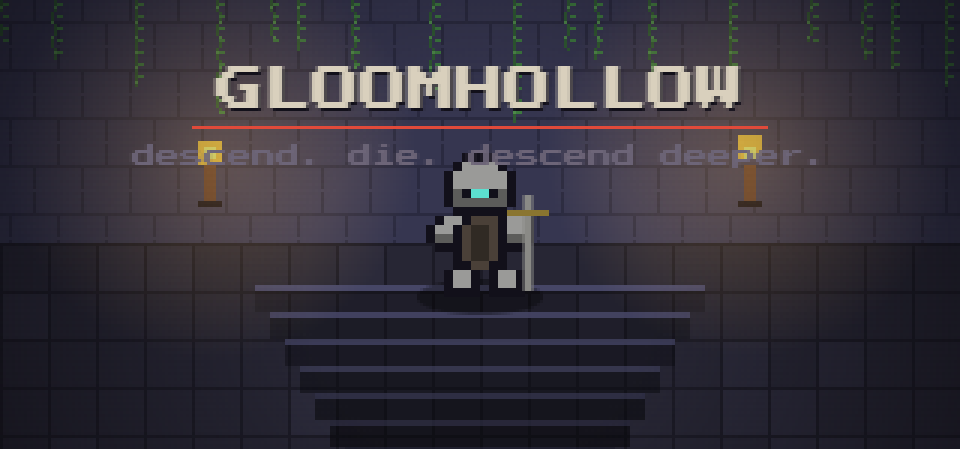
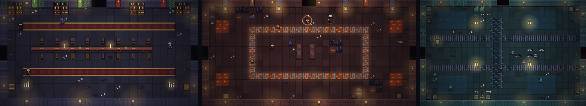
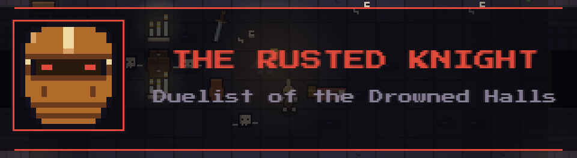
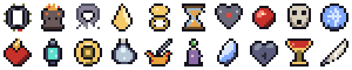

<h3 align="center">A slow, Souls-like pixel dungeon crawler. Five floors down to the Wyrm, then loop.</h3>

Plays in the browser on desktop and phone. Installs as an app from the browser menu and runs offline. No account, no download.

---

## The hollow

Every run is a new dungeon: three biomes, each with its own hazards, litter and set-piece rooms, then the Hollow Throne and the Wyrm's Maw. Rooms range from tight closets to halls wider than the screen.

## The fight

One strike per weapon, and a charged heavy on every one: hold right click, or hold the aim stick at its rim, then let go. Block in every direction. Time the block and you parry; parry and the riposte is yours. Roll through pits, dodge the red wedge where a blow is about to land, and drink from the well when you find it.

Fifteen weapons, from thief's daggers that loose a flurry to a tomb warhammer that shakes the ground. Magic comes back only between rooms. This is a melee game.

## The bosses

Each one gets a card as you walk in, and roars.

## The relics

Twenty relics, one copy of each per run, chests only. Every one bends a rule: a stone that spares you once a floor, a shard that turns one blow in five back on its owner, a candle that returns mana on a kill, a brand that charges heavies in half the time. Some are rarer than others. It won't tell you which.

## The bearings

Eighteen looks for your knight, each unlocked by a deed: parry ten strikes, search the fallen, slay the Warden untouched, slay the Rusted Knight and wear his helm.

## Controls

| Desktop | | Phone |
|---|---|---|
| WASD | move | left stick |
| mouse | aim | right stick, pull and release to strike |
| left click | strike | |
| hold right click | charge a heavy, release to swing | hold the stick at its rim |
| Shift | block, timed for a parry | BLOCK |
| Space | roll | ROLL |
| E, F, Q | spell, flask, use | SPELL, FLASK, USE |
| I, M | satchel, map | ITEMS, MAP |

Death sends you back to the first floor with fresh gear. There are no checkpoints. It's a roguelike.

---

Made by SicksSens3. All rights reserved.

