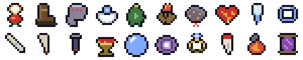

<h3 align="center">A slow, Souls-like pixel dungeon crawler. Six floors down to the Wyrm, then loop.</h3>

Plays in the browser on desktop and phone. Installs as an app from the browser menu and runs offline. No account, no download.

---

## Contents

[The descent](#the-descent) · [The fight](#the-fight) · [Weapons](#weapons) · [Spells](#spells) · [Enemies](#enemies) · [Bosses](#bosses) · [Rooms](#rooms) · [Gear](#gear) · [Relics](#relics) · [Bearings](#bearings) · [Loops, dailies, seeds](#loops-dailies-seeds) · [Controls](#controls)

## The descent

Every run is a new dungeon of six floors. Each floor is fifteen rooms or so around a start fire, with a boss at the far end and stairs behind it. Death sends you back to the first floor with fresh gear and nothing carried over but what you learned. There are no checkpoints.

| Floor | Name | Boss | What lives there |
|---|---|---|---|
| 1 | **Gloomhollow** | The Warden | Crypts, graves and a lost camp. Pits and spike floors. Hollows, cultists, brawlers, shieldbearers, wretches, bellringers. |
| 2 | **The Drowned Halls** | The Rusted Knight | Wrecks, fish traps and tide pools; water that slows you; the flooded hall. Drowned ones and anglers join the hollow. |
| 3 | **The Ember Depths** | The Cinder Witch | Forges and lava; the kiln. Imps and salamanders, and fire on the floor from both. |
| 4 | **The Tolling Deep** | Hells Bell | Bells on the walls, fallen bells on the floor, the carillon hall. Tollers in bell armour, and the ossuary again. |
| 5 | **The Hollow Throne** | The Hollow King | A bare hall before the last stair. Only the King. |
| 6 | **The Wyrm's Maw** | The Ashen Wyrm | The Wyrm's arena. Beat it and the hollow lets you go, or descend again. |

Foes hit harder on every floor down, and there are more of them in the deeper rooms of each floor. Elites appear more often the deeper you go.

## The fight

**One strike per weapon.** Tap to strike. Keep the button held past the strike and the weapon draws back and charges; release when it flashes for the heavy, or let go early for a plain strike. Every weapon has its own heavy, and they are slow and open: you cannot roll out of a heavy until it is nearly done.

**Block and parry.** The shield guards every direction. Time the block as the blow lands and you parry: the foe staggers, and your next strike is a riposte for heavy damage. Shieldbearers and bosses can be parried too.

**Roll.** Invulnerable for most of it. Roll through shockwaves, through the Wyrm's breath as it flashes, across pits, out of an angler's line.

**Stamina** pays for strikes, heavies and rolls, and comes back when you stop. **Mana** pays for spells and comes back only between rooms. This is a melee game. **Flasks** heal; you carry three, refilled at the start fire of each floor, and wells add to the count for the run.

**Telegraphs.** A dotted line shows your reach. A red wedge on the floor is where a foe's blow is about to land; a ring is a shockwave coming; a dashed line is a charge or a rupture.

**Souls** drop from everything you kill and buy from merchants and smiths. Nothing stays with you when you die.

## Weapons

Fifteen, found in chests, on arena pedestals and merchant counters. One or two per floor. Each has a plain strike and a named heavy.

| Weapon | Strike | Heavy | What the heavy does |
|---|---|---|---|
| **Rusted Shortsword** | plain, 18 damage | Wheel (0.6s charge, x1.6) | a full circle swing |
| **Thief Daggers** | very fast, chains, 11 damage | Flurry (0.4s charge, x0.65) | three cuts, each leaves the foe bleeding |
| **Bone Spear** | long thrust, 26 damage | Impale (0.7s charge, x1.75) | runs through every foe in a line |
| **Gravedigger Mace** | pounds the ground, staggers, 34 damage | Wrecker (0.9s charge, x1.6) | the whirl breaks into a full circle, then the pound |
| **Warden Greatsword** | huge, slow, 52 damage | Cleave (1.1s charge, x1.75) | hurls foes back and lays them out |
| **Ember Blade** | hits burn, 15 damage | Firewake (0.6s charge, x1.6) | leaves a crescent of fire burning |
| **Frost Axe** | hits slow, 34 damage | Shatter (0.9s charge, x1.6) | freezes; a chilled foe takes half again |
| **Hollow's Chain** | wide reach, weak, 14 damage | Haul (0.7s charge, x1.6) | drags every foe hit to your feet |
| **Soul Scythe** | drinks blood, 36 damage | Reap (1s charge, x1.6) | mends you for every foe hit |
| **Storm Rapier** | every strike lunges, 22 damage | Blink (0.5s charge, x1.6) | step through the foe, strike from behind |
| **Cursed Cleaver** | +50% dmg, bleeds you, 30 damage | Butcher (0.7s charge, x1.75) | triple damage to the nearly dead |
| **Gatewarden Halberd** | long, sweeping, 40 damage | Bulwark (1s charge, x1.6) | the sweep leaves a ward on you |
| **Tomb Warhammer** | crushing, shakes the ground, 60 damage | Tremor (1.4s charge, x2) | everything in the pound is stunned |
| **Duelist Sabre** | quick cuts, steps in, 17 damage | Passado (0.5s charge, x1.5) | a dash through the line, untouchable |
| **Gravedirt Katar** | fastest, short, 13 damage | Frenzy (0.35s charge, x0.6) | four cuts; each one returns stamina |

The smith's infusions add a burn, a chill or lifesteal to any weapon; the whetstone adds twenty percent.

## Spells

Cast with E, aimed where you look. Mana refills between rooms only.

| Spell | Mana | Effect |
|---|---|---|
| **Soul Bolt** | 20 | plain |
| **Bone Shards** | 26 | three bolts |
| **Grave Nova** | 30 | burst around you |
| **Shade Step** | 14 | short teleport |
| **Bone Ward** | 24 | absorbs one hit |
| **Frost Hex** | 22 | slows all foes |
| **Ember Lance** | 24 | burning bolt |
| **Soul Chain** | 18 | drags a foe to your blade |
| **Ashfall** | 28 | fire rains around you |

## Enemies

| Foe | Where | Health / hit | How it fights |
|---|---|---|---|
| **A hollow** | Floor 1 on | 34 / 14 | The rank and file. Closes in, curving from a side, and lunges. Cheap souls, and there are always more. The Warden throws them. |
| **A cultist** | Floor 1 on | 26 / 14 | Shoots arrows from range and ducks behind pillars and crates to reload, peeking out to fire. Take the cover away from it. |
| **A brawler** | Floor 1, deeper rooms | 48 / 13 | Sidesteps at mid range, then comes in with a two-hit lunge combo. The second hit follows quickly. |
| **A shieldbearer** | Floor 1, deeper rooms | 60 / 20 | Slow, and turns slowly. Blocks strikes from the front; a charged heavy or a parry breaks the guard. Lunges when it gets close. |
| **A wretch** | Packs of three | 14 / 6 | Small, fast and weaving. They bite for little but arrive together. |
| **A bellringer** | Floor 1 on, one per room | 30 / 10 | Hangs back and rings to bless the pack: faster and harder-hitting for a few seconds. Only swings when cornered. Kill it first. |
| **A drowned one** | The Drowned Halls | 70 / 22 | A slow, heavy slam up close, and from range a gout of black water. Water does not slow it. |
| **An angler** | The Drowned Halls | 60 / 20 | Casts a hook that drags you in for the bite. Roll to tear free of the line. |
| **An imp** | The Ember Depths | 30 / 14 | Kites at half pace, throws three fireballs that burn, then blinks away. Catch it between the shots. |
| **A salamander** | The Ember Depths | 45 / 14 | Circles at sword range leaving a burning trail, then whips its tail in a wide arc. Fire does nothing to it. |
| **A toller** | The Tolling Deep | 70 / 18 | A hollow under a bell helm. Swings wide. Below half health it stops and tolls: a shockwave that stuns you unless you roll through it. |

Stats are floor-one numbers; every floor down adds twenty percent health and sixteen percent damage.

**Elites** have a golden ring under them and one affix: **burning**, leaves fire where it walks; fire does not touch it; **warded**, three wards that only a heavy strike or a parry breaks; **swift**, faster, with shorter wind-ups; **thorned**, hurts you back when you hit it; **vampiric**, heals on every hit it lands. **Champions** (loops only) are named, half again as tough, rise once from death with a roar, and drop steel and a tome.

## Bosses

Each gets a title card as you walk in, and roars. Nothing moves until the card is done.

### The Warden · Floor 1

*Keeper of Gloomhollow.* 300 health, 34 a hit on the first descent.

A masked, gaping troll with a timber in one fist and a dead hollow in the other. He brings the timber down where you stand and it breaks the floor along its length; at arm's length he sweeps it wide; from range he hurls the hollow at you, and it gets up where it lands. Once that hand is empty and you are close, he snatches you and flings you across the room. He charges if you keep away, and tears another corpse from the floor every ten seconds. At two thirds health he roars (a shockwave) and rages: leaps onto you, charges from closer, slams twice. At a third he roars again and goes berserk: faster, every slam cracks a shockwave, the sweep comes back the other way, the charge ends in a crater.

**On a loop, as Warden Unchained (It remembers you).** Charges and leaps from the first second, and every slam sends a shockwave.

### The Rusted Knight · Floor 2

*Duelist of the Drowned Halls.* 240 health, 22 a hit on the first descent.

A duelist. Dashes in from range, and up close fights in three-hit combos. Below half health he throws his sword and dashes after it to take it back. Parry him and he staggers long enough for a riposte.

**On a loop, as Knight Reforged (Drowned twice. Risen twice.).** A whirling blade at mid range, a delayed final hit on the combo, and two drowned ones called up at half health.

### The Cinder Witch · Floor 3

*Mother of Embers.* 210 health, 16 a hit on the first descent.

Blinks away when you close. Volleys of fire bolts, rings of fire around herself, and a summons of imps below sixty percent. The floor she leaves burning is the fight.

**On a loop, as Witch Ascended (All fire is hers now).** Sweeping walls of fire and meteors that fall where you stood.

### Hells Bell · Floor 4

*Death comes ringing.* 340 health, 26 a hit on the first descent.

A giant with a bell for a head and a hand bell to ring. The toll is a shockwave that stuns you if it catches you standing: roll through it. The bell slam lays a line of broken floor toward you. At two thirds health he kneels and rings the dead up, untouchable until they fall. At a third the lights go out and he is gone; volleys of bell sparks cross the room in curtains, rings and rain until they are spent, then the lights return and so does he.

**On a loop, as Hells Bell (The last toll).** Two shockwaves per toll, four risen, six volleys and two spark patterns at once.

### The Hollow King · Floor 5

*Warden of the last stair.* 360 health, 26 a hit on the first descent.

Warden of the last stair, always at full strength. Calls the hollow at three quarters, half and a quarter health. Up close a wide sweep; at mid range a rupture, a line of rock thrown at you; from far, shadow bolts that turn to follow you. Below half he stomps a shockwave and moves faster.

### The Ashen Wyrm · Floor 6

*It was here before the hollow.* 500 health, 24 a hit on the first descent.

It fills the top of the arena. Its claws slam down and stay planted where they land, and that is where you hit it. The tail sweeps across, snaking, and rears up to slam where you stand, a shockwave and rubble. The breath is a cone that flashes together after its warning: roll through it and the head hangs open for a moment. Ember globs are lobbed at you and around you. Strike the raised head, or stand under it, and it lunges out on its neck to bite, then stays down and open. At half health it roars and the outer floor turns to lava; imps crawl out. At a quarter it roars again and the stage shrinks further.

**On a loop, as The Ashen Wyrm (It was here before the hollow).** Double claws, double tail passes, five globs.

## Rooms

| Room | What happens |
|---|---|
| **Combat rooms** | Most of the floor. Standard rooms, tall rooms, corridors and closets, each dressed in the biome's litter, plus grand rooms wider than the screen: the long hall, the stair hall, the dining hall, the library, and one set piece per biome. |
| **Arena** | Three waves, no doors until they are done. A weapon waits at the end. |
| **Treasure** | A chest. One or two weapons are hidden on each floor, in chests or on the merchant's counter; relics come from chests only. |
| **Vault** | Locked. The key is somewhere on the floor. |
| **Secret** | A hidden wall. Strike where the stone sounds wrong and a forgotten hoard opens. |
| **Shop** | A merchant behind a counter: flasks, gear, a tome or a weapon. Prices climb with every floor. |
| **Smith** | A whetstone (+20% weapon damage) and three infusions: Ember (hits burn), Frost (hits chill), Blood (hits drink). |
| **Shrine** | Three offerings, take one: a stat or a piece of school gear. |
| **Puzzle** | Braziers that keep an order (the notches tell it), pressure plates, idols turned to face the stone, or a walk across stones in one unbroken path. A wrong move raises a hollow. The prize matches the riddle. |
| **Trap** | The pit ring: treasure on an island of floor between two rings of pits. Roll across. Fall and you climb out on the side you came from. |
| **Blessed Well** | One a floor on the first three floors. Drink and carry one more flask for the rest of the run. |
| **Ossuary** | Floors 1 and 4. The fallen lie everywhere; search them, and some remember how to stand. |
| **Flooded hall** | Floor 2. A chest on an island in still water. Taking it brings the drowned up. |
| **Kiln** | Floor 3. A brazier riddle across a lava moat; solve it for an Ember Infusion. |
| **Belfry** | Floor 4's arena, where Hells Bell waits. |

**Events.** Some rooms carry one: **An ambush**, reinforcements drop in mid-fight. **A blood moon**, double souls, and every foe an elite. **The torches die**, you see only a few steps around you. **The fallen stir**, the corpses on the floor get up.

## Gear

From shrines, chests and merchants. Stackable, and every copy counts.

| Piece | Does |
|---|---|
| **Amulet of Deep Root** | +40 max HP |
| **Boots of Long Road** | +40 stamina |
| **Gauntlet of Ash** | +35% damage |
| **Stillwater Circlet** | +40 mana, +60% spells |
| **Cloak of the Wind** | +20% speed |
| **Vial of Old Blood** | +35 max health |
| **Bone Prayer Beads** | +35 max mana |
| **Pilgrim's Gourd** | +1 flask |

**Schools.** Twelve pieces that build a specialty. Stack them with a matching weapon or spell and it becomes a run.

| School | Pieces |
|---|---|
| **Fire** | **Kindling Charm**, +25% fire damage; **Wildfire Ash**, burning foes spread fire; **Cinder Heart**, longer fires; +20% vs burning |
| **Frost** | **Rime Tooth**, +20% vs the chilled; **Hoarfrost Band**, chills last twice as long; **Brittle Bone**, a chilled kill chills its neighbours |
| **Blood** | **Leech Fang**, melee drinks 5% as health; **Ruin Nail**, +25% vs the bleeding; **Sanguine Cup**, kills mend 3 |
| **Arcane** | **Focus Lens**, +30% spells; **Echo Stone**, spells cost a quarter less; **Conduit Ring**, melee hits return 2 mana |

## Relics

Twenty, one copy of each per run, chests only. Every one bends a rule. Some are rarer than others; it will not tell you which.

| Relic | Rule it bends |
|---|---|
| **Thorn Band** | parries wound the attacker |
| **Ember Idol** | every strike burns |
| **Veil of Smoke** | the whole roll is untouchable |
| **Aegis Shard** | a ward as each fight begins |
| **Miser's Ring** | half again the souls |
| **Cracked Hourglass** | foes wind up slower |
| **Iron Heart** | flasks heal 70 |
| **Bloodstone** | once a floor, death spares you |
| **Hollow Mask** | hit harder when near death |
| **Frost Sigil** | parries chill the attacker |
| **Ember Heart** | flasks burst into flame |
| **Drowned Lantern** | kills mend you a little |
| **Merchant's Seal** | every price a quarter off |
| **Quicksilver Vial** | rolls cost nothing, go farther |
| **Warden's Brand** | heavies charge fast and free |
| **Witch's Candle** | kills return mana |
| **Mirror Shard** | one blow in five turns back |
| **Gargoyle Heart** | no blow interrupts your swing |
| **Crimson Tithe** | +40% damage, flasks heal half |
| **Feather Charm** | pits do not hurt |

## Bearings

Eighteen looks for your knight, each unlocked by a deed. Cosmetic, kept across runs, and every one turns to face where you aim.

| Bearing | Deed |
|---|---|
| **Footman** | Plain steel. It will do. |
| **Hollow** | Fell 40 hollows |
| **Cultist** | Fell 20 cultists |
| **Duelist** | Parry 10 strikes |
| **Wanderer** | Search 8 of the fallen |
| **Gilded** | Find what the wall hides |
| **Sage** | Solve the brazier riddle |
| **Warden's Bane** | Slay the Warden |
| **Rustbound** | Slay the Rusted Knight |
| **Tidewalker** | Fell 20 drowned ones |
| **Cinderborn** | Fell 20 imps |
| **Gladiator** | Survive 3 arenas |
| **Unbroken** | Slay a boss untouched |
| **Ascetic** | Clear a floor without a flask |
| **Ashen One** | Reach floor 5 |
| **Reaper** | 300 kills in total |
| **Dawnbringer** | Clear floor 2 of a daily run |
| **Unhollowed** | Slay the Ashen Wyrm |

## Loops, dailies, seeds

Slay the Wyrm and you may descend again. Each loop turns the first four floors colder and stranger (Lower Gloomhollow, The Drowned Deep, The Ember Core, The Tolling Dark), meets the biome bosses in their second forms, adds champions and bigger halls, and scales everything up. The King and the Wyrm are always at full strength.

A **daily run** is the same dungeon for everyone that day; your deepest floor and souls are kept. **Seed** lets you replay a layout, or hand one to a friend. The **records** screen keeps your kills, parries, bosses and deaths.

## Controls

| Desktop | | Phone |
|---|---|---|
| WASD | move | left stick |
| mouse | aim | right stick, pull and release to strike |
| left click | release to strike; hold on, release when it flashes for the heavy | hold the stick at its rim |
| Shift or right click | block, timed for a parry | BLOCK |
| Space | roll | ROLL |
| E, F, Q | spell, flask, use | SPELL, FLASK, USE |
| I, M, Esc | satchel, map, pause | ITEMS, MAP, pause |

Menus take the arrow keys or the mouse. Press H on the title for the full list.

---

Made by SicksSens3. All rights reserved.

